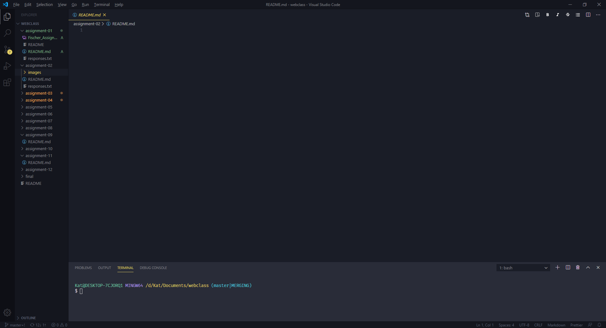

# Assignment 2
## Kat Fischer

In your README.md and using Markdown, title it "Assignment 2" with a heading 1. Underneath, add your name as a heading 2.
Add a paragraph sharing why decided to take the class!
Add a list of 3 things you've learned, or hope to learn.

I took a coding class in high school and haaaated it.  Everyone seemed to pick it up faster, produce cooler more complex projects, and I had a deserved B by the end which tanked my prized 4.0 gpa. That was fifteen years ago and I've had an absolute dread and despair attached to coding ever since.  Nevertheless, I can read the writing on the screen as the reality of our society transitions itself from brick and mortar 
  

Your README file for this homework's repo should also include:

A link to any website you visit frequently using its absolute URL.
A link to your responses.txt file using its relative URL.
An embedded image of your screenshot using its relative URL. image icon

http://www.muddycolors.com/

<a href="./responses.txt">Responses page </a>

