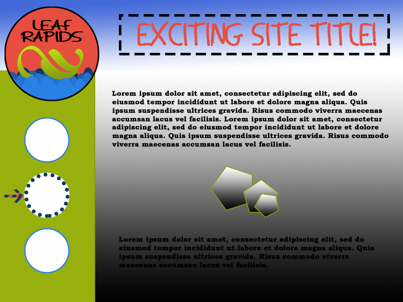

*What is the difference between padding, margin, and borders?*

Padding is the space between the contents and the container.
Margin is the space between an element and other elements.
Borders are the edge of an element, usually composed of width, style, and color.

*Embed the image of your sketch.*

*Free Response: Summarize your work cycle for this assignment.*
This took a lot of time and I didn't get everything done I wanted to. For some reason I was reading the next two assignments and started thinking we were supposed to make some client content for this mock-up, but it was good practice anyway.  

