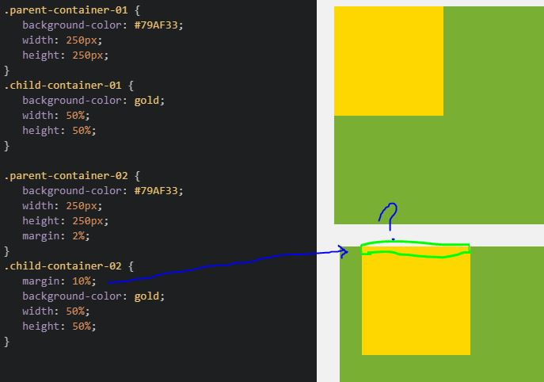

*Who was your imaginary client? How did they describe their site needs?*
Client provides insect colonies for pesticide control.  

*What is the difference between display: block, display: inline, and display: inline-block?*
Display: block can turn an inline element into a line-starting block element (used for vertical lists).
Display: inline shifts block elements into inline elements so they can share a horizontal row.
Display: inline-block is similar to inline except that block attributes of margin and vertical space are maintained.   

*Free Response: Summarize your work cycle for this assignment.*
I learned a lot on this, spent a lot of time asking my partner questions like why aren't my links centered in the div, it SHOULD be working! etc...
We went down a rabbit hole trying to understand why the 10% margin didn't apply to the top of the child box in this Module 11 codepen: 